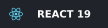
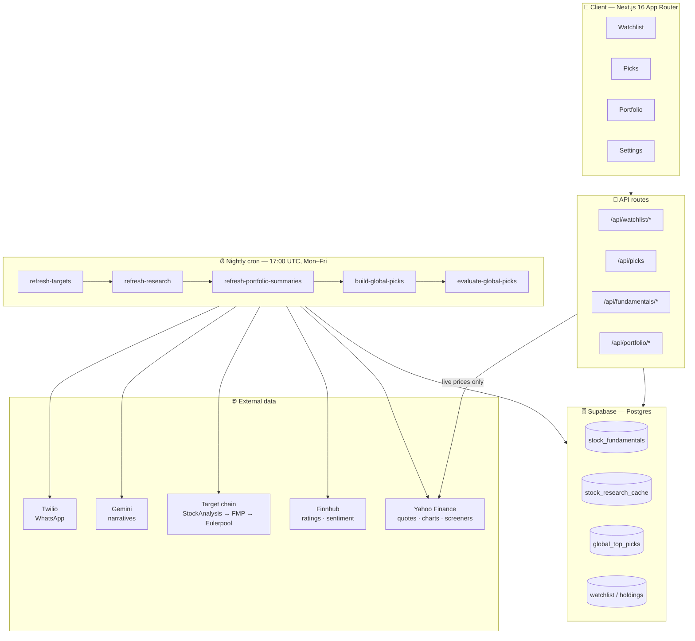
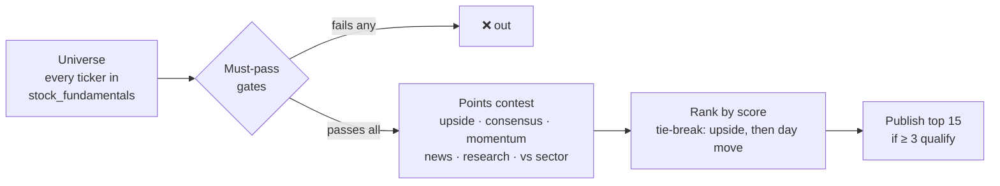

<div align="center">

# 📈 Stocklens

**A mobile-first decision-support app for US equities.**

Track the names you care about, get a nightly ranked shortlist scored on analyst targets,
price action and fundamentals, and review your portfolio with a daily briefing —
all behind invite-only Google sign-in.

<p>
  
  
  
  
  
</p>

[**▶ Live app**](https://stocklens-amber.vercel.app) · [Features](#-what-it-does) · [Architecture](#-architecture) · [How Picks work](#-how-picks-work) · [Setup](#-getting-started)

</div>

---

## The problem

Most stock apps show you a price and leave the thinking to you. Checking whether a name is
actually worth buying means opening five tabs — analyst targets on one site, fundamentals on
another, the 52-week range somewhere else, news sentiment nowhere in particular — and doing
the comparison in your head, every time, for every ticker.

Stocklens does that comparison once a night, mechanically, across the whole universe, and hands
you the fifteen names that survive. Everything else in the app exists to let you check its work.

## ✨ What it does

| | Feature | |
|---|---|---|
| 👁️ | **Watchlist** | Up to 30 US tickers with custom tags, sector grouping, and sort/filter by day change, target upside, or bullish/bearish signal |
| ⚡ | **Live prices** | 13-second auto-refresh during US regular hours (9:30–16:00 ET), closing prices with a **Closed** badge outside them |
| 🎯 | **Picks** | One shared list of up to 15 names, ranked overnight against analyst consensus, momentum, news and fundamentals |
| 💼 | **Portfolio** | Vested `.xlsx` sync, live P&L, per-holding attention/profit signals, and an AI daily summary |
| 📊 | **Research panel** | Earnings date, revenue and EPS growth, P/E vs sector median, 52-week range, analyst buy/hold/sell split |
| 📉 | **Vs sector** | Relative strength against the sector's benchmark ETF (XLK for Tech, and so on) |
| 💬 | **WhatsApp briefing** | Optional daily digest at 10:30 AM ET on US market days, via Twilio |
| 📱 | **Installable PWA** | Bottom-tab navigation, safe-area insets, 44px touch targets, add-to-home-screen |

## 🏗 Architecture



**The key design decision:** scoring never touches a live API. The nightly cron writes a scored
snapshot to Postgres; during the day `GET /api/picks` reads that snapshot and overlays only live
*prices* on top. Rank and factors stay fixed from last night, so the list doesn't reshuffle under
you while you're reading it — and a Yahoo outage at 11 AM can't take the Picks tab down.

## 🎯 How Picks work

Picks answers one question: *which US stocks look like strong buys right now, on analyst targets,
price action, news, fundamentals and sector context?*

It's a **filter funnel** followed by a **points contest**:



Gates are strict and binary — fail one and you're out, no partial credit. Only **high-confidence**
picks (≥ 15 analysts, > 60% buy) are published.

<details>
<summary><b>Must-pass gates — the exact thresholds</b></summary>

<br/>

| Gate | Threshold |
|---|---|
| Share price | ≥ **$5** |
| Market cap | ≥ **$500M** |
| Analyst coverage | ≥ **8** analysts |
| Sell ratings | ≤ **35%** |
| Buy ratings | ≥ **50%** |
| Price target | **Analyst consensus only** — no synthetic momentum targets |
| Upside to target | ≥ **8%** |
| News sentiment | Not negative, when known |
| 30-day trend | Not down, when known |
| Earnings | Excluded within **7 days** of the date |
| Business quality | Profitable **or** growing revenue YoY |
| Minimum score | ≥ **35** points |
| Confidence | **High only** |

</details>

<details>
<summary><b>Scoring table — where the points come from</b></summary>

<br/>

**Analyst upside** — the biggest lever

| Upside to target | Points |
|---|---|
| ≥ 30% | **+44** |
| ≥ 15% | **+31** |
| ≥ 8% | **+13** |

**Analyst consensus**

| Buy ratio | Points |
|---|---|
| > 70% | **+25** |
| > 50% | **+15** |
| ≥ 50% | **+8** |

**Price action & news**

| Signal | Condition | Points |
|---|---|---|
| 14-day pullback | −15% to −3%, upside still > 8% | **+12** |
| Volume spike | ≥ 1.5× avg → +8 · ≥ 2.0× → +12 | |
| Big move today | +2.5% → +8 · +5% → +10 · +8% → +12 (cap +12) | |
| Good news tone | Sentiment > 0.3 | **+10** |
| Near 20-day support | Within 3% above support | **+8** |
| 7-day momentum | ≥ +5% | **+6** |
| Above 20-day average | Price ≥ 20d avg | **+5** |
| News buzz | ≥ 8 articles in 7 days | **+5** |
| Healthy volume band | 1.2×–2.0× avg | **+4** |
| Near 52-week high | ≥ 97% of 52w high **and** upside < 5% | **−15** |

**Vs sector** — takes the better of relative strength or price delta, never both

| Signal | Condition | Points |
|---|---|---|
| Strong RS | score ≥ 65 | **+6** |
| Beating sector | 7d/30d delta ≥ +2% | **+5** |
| Lagging sector | delta ≤ −2% | **−3** |
| Weak RS | score ≤ 35 | **−4** |

**Fundamentals** — total research adjustment clamped to **±20**

| Signal | Condition | Points |
|---|---|---|
| Revenue YoY | > 15% / > 5% / < −10% | **+8** / **+4** / **−6** |
| Profit margin | > 15% / > 0% / < −20% | **+6** / **+3** / **−8** |
| EPS YoY | > 10% | **+5** |
| P/E vs sector median | ≤ 0.85× / ≥ 1.5× / ≥ 2.0× | **+5** / **−6** / **−10** |
| Debt / equity | < 1 / > 2.5 | **+4** / **−5** |
| Trailing P/E | 8–25 / ≥ 50 | **+4** / **−4** |
| Current ratio | > 1.5 | **+3** |

</details>

<details>
<summary><b>Where the scoring lives in the code</b></summary>

<br/>

| What | File |
|---|---|
| Gates, bonuses, ranking | `src/lib/picks-scoring-v2.ts` (`PICKS_V2_RULES`) |
| Research points | `src/lib/picks-research-scoring.ts` (`PICKS_RESEARCH_RULES`) |
| Vs-sector points | `src/lib/sector-relative-strength-scoring.ts` |
| Nightly build | `src/lib/cron/build-global-picks.ts` |
| API response shape | `src/lib/global-picks-response.ts` |

Tuning the numbers means editing the rule constants — they're deliberately in one place per concern.

The older **per-user** pipeline (`src/lib/picks-scoring.ts`) is kept for scripts and tests but no
longer powers the Picks tab.

</details>

> [!NOTE]
> **Not financial advice.** Scores are mechanical rules applied to cached data. They are a
> starting point for research, not a recommendation to buy anything.

## 🛠 Tech stack

| Layer | Choice |
|---|---|
| Framework | Next.js 16 (App Router) |
| UI | React 19, Tailwind CSS 4, Radix primitives, Lucide icons |
| Auth | NextAuth 5 + Google, with a Supabase email allow-list |
| Database | Supabase (Postgres + RLS) |
| Client data | SWR |
| Market data | Yahoo Finance — quotes, charts, screeners |
| Fundamentals | Finnhub — recommendations, sentiment |
| Analyst targets | StockAnalysis → FMP → Eulerpool → Finnhub → Yahoo → 52w high |
| LLM *(optional)* | Google Gemini `gemini-2.5-flash` |
| Messaging *(optional)* | Twilio WhatsApp |
| Portfolio import | `xlsx` — Vested export |

## ⏰ Scheduled jobs

One Vercel cron entry point, `/api/cron/nightly` at **17:00 UTC, Mon–Fri**, runs six steps in
order and reports per-step success:

```
refresh-targets → refresh-research → refresh-portfolio-summaries
    → build-global-picks → evaluate-global-picks → [Mon] send-picks-accuracy-report
```

Each step also has its own route under `/api/cron/*` for manual runs. All of them require
`Authorization: Bearer $CRON_SECRET`.

## 🚀 Getting started

**Prerequisites** — Node 20+, a Supabase project, a Google Cloud OAuth client, and a free
Finnhub API key. FMP, Eulerpool, Gemini and Twilio keys are all optional.

```bash
git clone https://github.com/prakashshuklahub/stocklens.git
cd stocklens
npm install
cp .env.example .env.local
npm run dev
```

<details>
<summary><b>Environment variables</b></summary>

<br/>

| Variable | Required | Purpose |
|---|---|---|
| `NEXTAUTH_URL` | ✅ | `http://localhost:3000` in dev |
| `NEXTAUTH_SECRET` | ✅ | `openssl rand -base64 32` |
| `GOOGLE_CLIENT_ID` / `GOOGLE_CLIENT_SECRET` | ✅ | OAuth 2.0 web client |
| `SUPABASE_URL` / `SUPABASE_ANON_KEY` / `SUPABASE_SERVICE_ROLE_KEY` | ✅ | Supabase API keys |
| `FINNHUB_API_KEY` | ✅ | Recommendations & sentiment |
| `FMP_API_KEY` | — | Analyst targets, fallback chain |
| `EULERPOOL_API_KEY` | — | Analyst targets, fallback chain |
| `GEMINI_API_KEY` | — | AI narratives |
| `TWILIO_ACCOUNT_SID` / `TWILIO_AUTH_TOKEN` / `TWILIO_WHATSAPP_FROM` | — | WhatsApp briefing |
| `RESEND_API_KEY` / `EMAIL_FROM` / `PICKS_REPORT_EMAIL` | — | Weekly accuracy email |
| `CRON_SECRET` | prod | Cron route authorization |
| `DATABASE_URL` | — | `scripts/migrate.mjs` only |

</details>

<details>
<summary><b>Database, access and OAuth setup</b></summary>

<br/>

**1. Migrations** — run `supabase/migrations/run_once_combined.sql` in the Supabase SQL editor for
a fresh project, then apply any newer numbered migrations. Or use the CLI migrator:

```bash
node scripts/migrate.mjs
```

**2. Allow your account** — sign-in is invite-only:

```sql
INSERT INTO allowed_emails (email) VALUES ('you@gmail.com');
```

**3. Google OAuth redirect URIs**

- Origins: `http://localhost:3000` and your production URL
- Redirect: `http://localhost:3000/api/auth/callback/google` and the production equivalent

</details>

<details>
<summary><b>API routes</b> — authenticated unless noted</summary>

<br/>

| Route | Purpose |
|---|---|
| `GET/POST /api/watchlist` | List / add watchlist entries |
| `PATCH/DELETE /api/watchlist/[ticker]` | Update tags / remove |
| `GET /api/watchlist/search` | Yahoo ticker search |
| `GET /api/watchlist/suggestions` | Trending ideas |
| `POST /api/watchlist/suggestions/skip` | Dismiss a suggestion |
| `GET /api/fundamentals/batch` | Cache-first fundamentals for the whole watchlist |
| `GET /api/fundamentals/[ticker]` | Single ticker |
| `GET /api/signals` | Bullish / bearish / quiet classification |
| `GET /api/picks` | Nightly top picks with live price overlay |
| `GET /api/picks/narratives` | Poll for LLM narrative updates |
| `GET /api/picks/headlines` | Headlines for pick cards |
| `GET /api/research/[ticker]` | Cached research panel data |
| `GET /api/chart/[ticker]` | Price chart series |
| `GET /api/portfolio` | Holdings with live prices |
| `POST /api/portfolio/sync` | Vested `.xlsx` upload |
| `GET /api/portfolio/summary` | AI daily summary |
| `GET /api/portfolio/signals/[ticker]` | Per-holding signal detail |
| `GET/PATCH /api/user/settings` | WhatsApp number & preferences |
| `GET /api/cron/*` | Scheduled jobs — Bearer `CRON_SECRET` |

</details>

<details>
<summary><b>Project structure</b></summary>

<br/>

```
src/
├── app/
│   ├── (app)/              # watchlist · picks · portfolio · settings
│   ├── api/                # 31 REST + cron routes
│   └── login/
├── components/
│   ├── watchlist/          # cards, search, tags, suggestions
│   ├── picks/              # pick cards, loading states
│   ├── portfolio/          # holdings, daily summary
│   ├── settings/ signals/
│   └── AppNav · LiveRefreshHeader · StockResearchPanel · VsSectorPanel
├── hooks/                  # useMarketOpen · useLivePriceRefresh
└── lib/
    ├── picks-scoring-v2.ts · picks-research-scoring.ts   # the scoring engine
    ├── cron/               # nightly job fan-out
    ├── live-prices.ts · market-hours.ts · yahoo-*.ts
    ├── portfolio-summary-*.ts
    ├── twilio/ · whatsapp/
    └── llm.ts
supabase/migrations/
vercel.json                 # cron schedule
```

</details>

## 📋 Data model

**Per-user**, filtered by `user_id` — `watchlist_stocks`, `watchlist_tags`, `portfolio_holdings`,
`portfolio_daily_summaries` (keyed by user + holdings hash), preferences on `users`, and a
per-user trending skip list.

**Shared**, no `user_id` — `stock_fundamentals` (prices ~30 min, targets daily), `stock_research_cache`,
`global_top_picks` / `global_top_picks_runs` (a scoring snapshot per run), narrative caches with a
~3 hour TTL, `watchlist_suggestions_cache`, `stock_logos`, `sector_benchmarks`.

## 🌐 External services & limits

- **Yahoo Finance** — unofficial endpoints; live prices refresh every 13s during regular hours only.
- **Finnhub free tier** — recommendations and sentiment; paid-only endpoints avoided.
- **Target chain** — falls back through five sources before resorting to the 52-week high; cached with a daily 5pm IST reset.
- **Gemini** — optional; sequential calls with delays to avoid 429s, narratives cached 3 hours.
- **Twilio** — optional; at most one briefing per user per US trading day.

## 📦 Scripts

| Command | Description |
|---|---|
| `npm run dev` | Development server |
| `npm run build` | Production build |
| `npm start` | Production server |
| `npm run lint` | ESLint |
| `npm run generate-icons` | Regenerate PWA icon assets |
| `node scripts/migrate.mjs` | Apply SQL via `DATABASE_URL` |

---

<div align="center">

Built by **[Prakash Shukla](https://github.com/prakashshuklahub)**

[The Hustling Engineer](https://www.youtube.com/@TheHustlingEngineer) · [LinkedIn](https://www.linkedin.com/in/prakash-shukla/)

<sub>Private project — all rights reserved unless otherwise specified by the repository owner.</sub>

</div>
