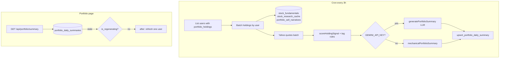

# Daily Portfolio Summary — feature plan

**Status:** Implemented (Phase 1 mechanical + Phase 2 LLM/cron)

**Goal:** Give users a **portfolio-level briefing** they can scan in under 30 seconds — one short summary per holding plus optional portfolio headline — refreshed on a **3-hour TTL** and stored in Supabase as structured JSON.

**Related docs:** [portfolio-review.md](./portfolio-review.md) (bearish alerts only), [picks-architecture.md](./picks-architecture.md) (narrative + cron patterns)

**Resolve before Phase 1:** staleness rules (§3.2), tag priority order (§4.2), portfolio sentiment aggregation (§6.3), inflight dedupe (§5.3).

---

## 1. Problem & scope

### What exists today

| Feature | Covers | Gap |
|---------|--------|-----|
| Portfolio summary bar | Today P&L, unrealized P&L | No narrative |
| Holding cards + tier filters | P&L, cost, signal tier, expandable “Why flagged?” | Only **attention / soft / profit** tiers get copy; **quiet** holdings have no story |
| Portfolio review / alerts | Bearish multi-factor alerts | Negative bias; not a daily “state of the portfolio” |
| `stock_fundamentals` + `stock_research_cache` | Rich metrics in DB | Not surfaced as a portfolio briefing |
| `portfolio_sell_narratives` | LLM/mechanical copy for **flagged** tickers only | Not a full-portfolio scan; per-ticker global cache |

### What this feature adds

- **All holdings** get a 2–3 line summary (not just flagged ones).
- **Structured tags** (Earnings Beat, Target Raised, Strong Momentum, …) for quick scanning.
- **Sentiment badge** per stock: Positive / Neutral / Negative.
- **Cached in DB** — UI reads cache; generation runs on cron + optional on-demand refresh.
- **Collapsible card** above portfolio tier filters on the Portfolio tab.

### Out of scope (v1)

- Push notifications / email digest
- Historical summary archive (“what changed since yesterday”)
- Insider transaction feeds (`insider_selling` tag — **Phase 3** when a real API exists)
- Per-user LLM when `GEMINI_API_KEY` is unset (mechanical fallback required)

---

## 2. User experience

### Placement

```
Portfolio tab
├── Summary bar (current value, today, unrealized)     ← existing
├── **Daily Portfolio Summary** (new, collapsible)     ← NEW
├── Tier filter chips                                  ← existing
└── Holding cards                                      ← existing
```

### Collapsed header (example)

```
Daily briefing · 12 stocks · updated 2h ago          [chevron]
Portfolio slightly red today; MU and TSM weigh on gains.
```

**“Updated X ago” when market is closed**

| Condition | UI copy |
|-----------|---------|
| `market_session === 'regular'` and age > 3h | Show age + subtle “Updating…” if refresh inflight |
| `market_session === 'closed'` and summary generated **after last regular close** | Show age **without** stale warning (prices aren’t moving) |
| `market_session === 'closed'` and summary is **pre-close** (e.g. Saturday, last run Friday 10am) | “Last market close briefing · updated Fri 4pm” — no “broken” stale state |

### Expanded — per holding row

```
[logo] MU   [Negative]   [Weak Momentum] [Heavy Sell Ratings]
Memory names are down ~1% today and remain a drag on the portfolio.
Analyst consensus skews cautious; 30-day trend is still weak vs your cost.
```

If `degraded_input: true` for a row (missing fundamentals/research), show a muted footnote: “Limited data for this name.”

### Scan target

| Portfolio size | Target read time | Default expand |
|----------------|------------------|----------------|
| ≤12 holdings | ~30 s | **Expanded** on first visit (no `localStorage` key yet) |
| 13–19 holdings | ~40 s | Expanded first visit; remember user preference after |
| 20+ holdings | Collapsed by default after first visit | Sort flagged / negative first when expanded |

**Collapse persistence:** `localStorage` key `portfolio-summary-open`. First visit → expanded; thereafter respect saved preference (default collapsed when ≥20 holdings).

### Empty / loading

| State | UI |
|-------|-----|
| No holdings | Hide section (same as filters) |
| First visit, cache miss | Skeleton matching holding-row layout; subtitle “Preparing your briefing…” |
| Stale cache (>3h, market open) | Show last summary + “Updating…” footer; background refresh |
| LLM off | Same layout; footer “Summary from signals · not AI” |

---

## 3. Structured data model

### TypeScript shape (API + DB JSON)

```ts
type PortfolioSummarySentiment = 'positive' | 'neutral' | 'negative'

/** v1 allowlist — no insider_selling until Phase 3 */
type PortfolioSummaryTag =
  | 'earnings_beat'
  | 'earnings_miss'
  | 'earnings_soon'
  | 'target_raised'
  | 'target_cut'
  | 'weak_guidance'
  | 'strong_momentum'
  | 'weak_momentum'
  | 'analyst_upgrade'
  | 'analyst_downgrade'
  | 'heavy_sell_ratings'
  | 'strong_buy_ratings'
  | 'negative_news'
  | 'positive_news'
  | 'near_52w_high'
  | 'near_52w_low'
  | 'profit_target_reached'

type HoldingDailySummary = {
  ticker: string
  company_name: string | null
  sentiment: PortfolioSummarySentiment
  tags: PortfolioSummaryTag[]          // max 4 — see §4.2 priority order
  summary: string                      // 2–3 sentences, plain language
  headline?: string                    // one-liner for portfolio header aggregation
  degraded_input?: boolean             // true when fundamentals or price missing
}

type PortfolioDailySummaryPayload = {
  version: 1
  generated_at: string                 // ISO — when this payload was written
  holdings_hash: string                // positions-only fingerprint — see §3.1
  market_session: 'regular' | 'closed'
  portfolio_headline: string
  portfolio_sentiment: PortfolioSummarySentiment  // value-weighted — see §6.3
  holdings: HoldingDailySummary[]
  /** Tickers that used degraded/mechanical-only inputs (debug + UI footnote) */
  degraded_tickers: string[]
  inputs_as_of: {
    prices_at: string | null
    fundamentals_age_min: string | null   // oldest fundamentals row used
    fundamentals_age_max: string | null   // newest fundamentals row used
    research_age_min: string | null
    research_age_max: string | null
  }
  narrative_source: 'llm' | 'mechanical'
  model?: string | null
}
```

### 3.1 Cache invalidation — two separate concerns

Do **not** treat `holdings_hash` and TTL as one vague “stale” flag. Regenerate when **either** condition is true:

| Trigger | When | Why |
|---------|------|-----|
| **A. Holdings changed** | `holdings_hash !== stored hash` | Sync added/removed/changed qty or cost |
| **B. Time TTL** | `now - generated_at > 3h` (`NARRATIVE_TTL_HOURS`) | Prices, day %, and narrative context drift intraday |
| **C. Force** | User `?refresh=1` during live market (optional v2) | Manual refresh |

**Important:** Same holdings at 9am vs 2pm **must** get a new summary after TTL expires even if hash is unchanged. Hash alone is **not** sufficient freshness.

#### `holdings_hash` algorithm (single implementation)

**File:** `src/lib/portfolio-summary-hash.ts`

```ts
// 1. Sort holdings by ticker ASC (case-insensitive)
// 2. Build string: `${TICKER}:${quantity}:${avg_cost_basis.toFixed(4)}` joined by '|'
// 3. SHA-256 hex digest (Node crypto.createHash('sha256'))
```

Example: `AAOI:3:12.5000|AMD:3:98.2500|…`

Unit-test golden vectors so cron and API never diverge.

### Supabase table (proposed)

**Migration:** `018_portfolio_daily_summaries.sql`

```sql
CREATE TABLE portfolio_daily_summaries (
  user_id            uuid PRIMARY KEY REFERENCES users(id) ON DELETE CASCADE,
  payload            jsonb NOT NULL,
  holdings_hash      text NOT NULL,
  generated_at       timestamptz NOT NULL DEFAULT now(),
  narrative_source   text NOT NULL CHECK (narrative_source IN ('llm', 'mechanical')),
  model              text,
  is_regenerating    boolean NOT NULL DEFAULT false,
  regenerate_started_at timestamptz
);

ALTER TABLE portfolio_daily_summaries ENABLE ROW LEVEL SECURITY;

CREATE POLICY "portfolio_daily_summaries_select_own"
  ON portfolio_daily_summaries FOR SELECT
  USING (user_id = auth.uid());

CREATE INDEX portfolio_daily_summaries_generated_idx
  ON portfolio_daily_summaries (generated_at DESC);

-- Upsert path: cron/API call function only — not arbitrary service-role writes
CREATE OR REPLACE FUNCTION upsert_portfolio_daily_summary(
  p_user_id uuid,
  p_payload jsonb,
  p_holdings_hash text,
  p_narrative_source text,
  p_model text
) RETURNS void
LANGUAGE plpgsql
SECURITY DEFINER
SET search_path = public
AS $$
BEGIN
  INSERT INTO portfolio_daily_summaries (
    user_id, payload, holdings_hash, generated_at,
    narrative_source, model, is_regenerating, regenerate_started_at
  ) VALUES (
    p_user_id, p_payload, p_holdings_hash, now(),
    p_narrative_source, p_model, false, NULL
  )
  ON CONFLICT (user_id) DO UPDATE SET
    payload = EXCLUDED.payload,
    holdings_hash = EXCLUDED.holdings_hash,
    generated_at = EXCLUDED.generated_at,
    narrative_source = EXCLUDED.narrative_source,
    model = EXCLUDED.model,
    is_regenerating = false,
    regenerate_started_at = NULL;
END;
$$;

REVOKE ALL ON FUNCTION upsert_portfolio_daily_summary FROM PUBLIC;
-- Grant only to service role via Supabase dashboard or migration role
```

**Cron route** calls `upsert_portfolio_daily_summary()` — even if `CRON_SECRET` leaks, attacker cannot arbitrary-update other tables.

**Why per-user row (not per-ticker global cache)?**

- Summaries reference **user context** (position P&L, weight in portfolio, “your cost”).
- Same ticker reads differently for two users (one underwater, one up 80%).
- Aligns with `portfolio_holdings` RLS.

**Reuse flagged-ticker copy (cost saving):** For holdings in `attention` / `soft` / `profit` tiers, pass existing `portfolio_sell_narratives.review_reason` into the LLM prompt (or mechanical composer) instead of regenerating from scratch — reduces overlap and improves consistency.

**TTL:** 3 hours — same as `NARRATIVE_TTL_HOURS`, `portfolio_sell_narratives`, `RESEARCH_TTL_MS`.

---

## 4. Input signals (reuse existing APIs only)

Generation **must not** call Finnhub/Yahoo unbounded per user. Read from DB + one batched Yahoo quote pass (same as `/api/portfolio`).

### Per holding — build a `SummaryInput` object

| Field | Source | Used for |
|-------|--------|----------|
| `ticker`, `quantity`, `avg_cost_basis` | `portfolio_holdings` | User context |
| `price`, `change_1d_pct` | Yahoo v7 (regular session) | Today move |
| `position_pnl_pct`, `weight_pct` | computed from prices | Sentiment weighting |
| `change_7d_pct`, `change_30d_pct` | `stock_fundamentals` | Momentum tags |
| `analyst_buy/hold/sell` | `stock_fundamentals` | Upgrade/downgrade tags |
| `target_price`, `target_source`, upside | `stock_fundamentals` + helpers | Target raised/cut |
| `news_sentiment` | `stock_fundamentals` | Good/bad news |
| `week52_high/low`, `support_20d` | `stock_fundamentals` | Context / risk (**dropped when trimming — §6.2**) |
| `revenue_growth_pct`, `earnings_growth_pct`, margins | `stock_research_cache` | Earnings quality |
| `earnings_date` | `stock_research_cache` | Earnings soon |
| `signal_tier`, `signal_factors` | `scoreHoldingSignal()` | Align with existing flags |
| `existing_review_reason` | `portfolio_sell_narratives` (if flagged) | Reuse LLM/mechanical alert copy |

v1: **no live Google News RSS** in cron — use `news_sentiment` + keyword tags only.

### 4.1 Tag derivation (mechanical, pre-LLM)

Rules live in **`src/lib/portfolio-summary-tags.ts`**.

| Tag | Rule (sketch) |
|-----|----------------|
| `strong_momentum` | `change_30d_pct >= 10` or (`change_7d_pct >= 5` and `change_1d_pct >= 0`) |
| `weak_momentum` | `change_30d_pct <= -10` or sharp 7d decline |
| `target_raised` | v2: target moved up vs prior payload; v1: skip or infer from upside band |
| `heavy_sell_ratings` | sell count ≥ threshold (same as portfolio scoring) |
| `analyst_upgrade` / `downgrade` | `news.ts` headline keywords + analyst skew |
| `earnings_soon` | `daysUntil(earnings_date) <= 7` |
| `earnings_beat` / `miss` | headline keywords + news tone (no live earnings API v1) |
| `profit_target_reached` | profit tier from `scoreHoldingSignal` |

### 4.2 Tag priority (max 4 — explicit order)

When more than 4 tags match, keep the **lowest index** (highest priority):

| Priority | Tag |
|----------|-----|
| 1 | `earnings_soon` |
| 2 | `earnings_beat`, `earnings_miss` |
| 3 | `analyst_upgrade`, `analyst_downgrade` |
| 4 | `target_raised`, `target_cut`, `weak_guidance` |
| 5 | `profit_target_reached` |
| 6 | `heavy_sell_ratings`, `strong_buy_ratings` |
| 7 | `strong_momentum`, `weak_momentum` |
| 8 | `positive_news`, `negative_news` |
| 9 | `near_52w_high`, `near_52w_low` |

Implement as ordered array in `portfolio-summary-tags.ts`; unit test tie-break cases.

Tags are passed to the LLM as **hints** and filtered post-generation (must ⊆ allowlist).

---

## 5. Generation pipeline



### 5.1 Staleness check (pseudocode)

```ts
function needsRegenerate(row, currentHash, now): boolean {
  if (!row) return true
  if (row.holdings_hash !== currentHash) return true  // Trigger A
  if (age(row.generated_at) > NARRATIVE_TTL_HOURS) return true  // Trigger B
  return false
}
```

### 5.2 Cron route

**`GET /api/cron/refresh-portfolio-summaries`**

| Step | Action |
|------|--------|
| 1 | Auth: `Authorization: Bearer CRON_SECRET` (reject otherwise — no writes) |
| 2 | Select distinct `user_id` from `portfolio_holdings` |
| 3 | Skip if `!needsRegenerate()` for that user |
| 4 | Skip if `is_regenerating === true` and started < 10 min ago |
| 5 | Process **≤10 users/run**; **2s gap** between LLM calls (`LLM_CALL_DELAY_MS`) |
| 6 | Call `upsert_portfolio_daily_summary()` via RPC |

### 5.3 Inflight dedupe (thundering herd prevention)

**Problem:** After a cron gap, many users opening Portfolio simultaneously each fire `after()` regenerate.

**Mechanism (both layers):**

1. **DB lock column:** Before generate, `UPDATE … SET is_regenerating = true, regenerate_started_at = now() WHERE user_id = $1 AND (is_regenerating = false OR regenerate_started_at < now() - interval '10 minutes') RETURNING user_id`. If 0 rows → another worker owns it; exit.
2. **Process memory lock:** Module-level `Map<userId, Promise>` in `src/lib/portfolio-summary-schedule.ts` (same pattern as `trending-cache-schedule.ts` inflight dedupe).

Always clear `is_regenerating` in `finally` block; stale locks auto-expire after 10 minutes.

### 5.4 On-demand refresh

**`GET /api/portfolio/summary`**

| Case | Behavior |
|------|----------|
| Cache hit, fresh | Return payload, `stale: false` |
| Cache miss or stale (A or B) | Return **existing** payload if any, `stale: true`; trigger single-user regenerate if lock acquired |
| No holdings | `{ summary: null }` |
| Regenerate inflight | Return stale payload + `refreshing: true` |

Same **`after()`** pattern as `/api/picks` — never block page on LLM.

**File layout:**

- `src/lib/portfolio-summary-hash.ts` — holdings fingerprint
- `src/lib/portfolio-summary-tags.ts` — tag rules + priority
- `src/lib/portfolio-summary-generate.ts` — input assembly + LLM + mechanical
- `src/lib/portfolio-summary-schedule.ts` — inflight dedupe + `regenerateIfNeeded()`
- `src/lib/cron/refresh-portfolio-summaries.ts`
- `src/app/api/cron/refresh-portfolio-summaries/route.ts`
- `src/app/api/portfolio/summary/route.ts`

---

## 6. LLM design

### When LLM runs

- Cron batch (preferred)
- On-demand when `needsRegenerate()` and lock acquired
- **Not** on every holding card expand

### 6.1 Prompt inputs

Structured JSON only — no raw API dumps:

- Portfolio: `{ today_pnl_pct, up_count, down_count, total_value }`
- Per ticker (compact): `{ ticker, weight_pct, pnl_pct, d1, d7, d30, analyst_buy, analyst_sell, target_upside, signal_tier, tags[], facts[] }`
- Optional: `existing_review_reason` for flagged names
- Style: 2–3 sentences per holding; no buy/sell commands; facts from input only

### 6.2 Token budget (large portfolios)

| Holdings count | Input policy |
|----------------|--------------|
| ≤14 | Full `SummaryInput` per ticker |
| 15–24 | Drop `week52_low`, `support_20d`, `change_7d_pct`; cap `facts[]` to 3 lines |
| 25+ | Sort by `weight_pct` desc; **summarize bottom 25% weight** as `{ ticker, weight_pct, d1, sentiment_hint }` only; full detail for top 75% |

Log when trimming activates (`[portfolio-summary] trimmed input N holdings`). If estimated input tokens > 6k, force mechanical for that user and log `reason: token_budget`.

Target: **≤6k input tokens** including instructions.

### 6.3 Portfolio-level sentiment aggregation

**Value-weighted**, not simple plurality:

```ts
// Per holding: map sentiment → score (+1, 0, -1)
// portfolio_sentiment = sign( sum(weight_pct * score) )
// Tie near zero (|sum| < 0.15) → 'neutral'
```

Example: 8 neutral small positions + 2 negative names at 60% combined weight → **`negative`**.

`portfolio_headline` LLM prompt receives this weighted context explicitly.

### Output validation

- Parse JSON; reject if any `summary` > 400 chars or missing sentiment
- Strip tags not in allowlist; re-apply max-4 priority filter
- On failure: log `llm_parse_failed` + fallback to `mechanicalPortfolioSummary()` — **never silent fallback**

### 6.4 Mechanical fallback (quality bar)

Match **`mechanicalSignalReview`** specificity in `portfolio-alerts.ts` — not a one-line template.

**File:** `src/lib/portfolio-summary-mechanical.ts`

- Template library keyed by **primary tag** + **sentiment** (+ optional secondary tag)
- Examples:
  - `weak_momentum` + `heavy_sell_ratings` → multi-sentence caution copy
  - `strong_momentum` + `strong_buy_ratings` → momentum + analyst support
  - `earnings_soon` → calendar-aware sentence regardless of day move
  - `profit_target_reached` → reuse `mechanicalProfitReview` phrasing
- Flagged holdings: prefer **`portfolio_sell_narratives.review_reason`** when fresh (<3h) before generic template
- Set `degraded_input: true` and add ticker to `degraded_tickers` when price or fundamentals missing

### Model & cache (cost parity with Picks)

| Layer | Pattern | Same as existing? |
|-------|---------|-------------------|
| Gemini TTL | 3h (`NARRATIVE_TTL_HOURS`) | Yes |
| Finnhub/FMP on hot path | **0** — DB read only | Yes |
| Yahoo | 1 batched quote call / refresh | Yes (portfolio already does this) |
| Gemini calls | **1 per user per refresh** (all holdings in one JSON) | Similar; picks uses per-ticker |
| Cache table | Per-user row (not global per ticker — user context required) | Different shape, same TTL rules |
| Mechanical | When no `GEMINI_API_KEY` or LLM failure | Yes |
| Sequential cron | `mapSequential` + 1200ms delay | Yes |
| Helpers | Reuse `src/lib/llm.ts`, `narrative-cache.ts` constants | Yes |

**New Gemini spend:** ~1 request / active user / 3h when LLM enabled. Mitigated by cron caps, inflight dedupe, and mechanical path.

---

## 7. API contract

### `GET /api/portfolio/summary`

```ts
type PortfolioSummaryResponse = {
  summary: PortfolioDailySummaryPayload | null
  stale: boolean
  refreshing: boolean
  llm_enabled: boolean
}
```

Headers: `Cache-Control: private, no-store` when `market_session === 'regular'`; `private, max-age=300` when closed optional.

### Cron response

```ts
{
  users_total: number
  users_skipped_fresh: number
  users_skipped_inflight: number
  users_attempted: number
  summaries_written: number
  mechanical_fallbacks: number
  token_budget_fallbacks: number
  errors: string[]
}
```

---

## 8. Cron schedule & API budget

### IST off-hours window (`src/lib/cron/window.ts`)

Scheduled and background API/Gemini work is **skipped** during:

- **Mon–Fri, 3:00am–2:59pm IST**
- **All day Saturday and Sunday**

Allowed window: **Mon–Fri from 3:00pm IST through 3:00am IST** (next calendar day).

Applies to: all `/api/cron/*` routes, portfolio briefing `after()`, pick narrative background jobs, picks `after()` (trending + fundamentals refresh).

User-initiated actions (signal review, manual scripts) are **not** gated.

### Vercel schedules (UTC → IST, Mon–Fri only)

| Job | UTC cron | IST |
|-----|----------|-----|
| refresh-targets | `30 15 * * 1-5` | 9:00pm |
| refresh-research | `0 16 * * 1-5` | 9:30pm |
| refresh-portfolio-summaries | `30 16 * * 1-5` | 10:00pm |

### Target: refresh every 3 hours (in allowed window)

| Constraint | Implication |
|------------|-------------|
| **Vercel Hobby** | 1 cron run/day per job — use **`after()` on Portfolio load** as primary freshness for active users |
| **Vercel Pro** | `"schedule": "0 */3 * * *"` |
| **Dev** | `scripts/refresh-portfolio-summaries-now.ts` + manual trigger |

**Recommended MVP:** daily cron warm + `after()` when `needsRegenerate()` for users who open the tab.

### Cost per user refresh

| Step | External calls |
|------|----------------|
| Yahoo quotes | 1 batch |
| Fundamentals / research / sell narratives | 0 (DB) |
| Gemini | 0–1 request (~2–6k input tokens depending on trim) |

**Cron cap:** ≤10 users/run, 2s between LLM calls.

---

## 9. UI implementation sketch

**`src/components/portfolio/PortfolioDailySummary.tsx`**

- SWR: `/api/portfolio/summary`
- First visit: expanded; then `localStorage` `portfolio-summary-open`
- ≥20 holdings: default collapsed on return visits
- Reuse `CollapseChevron`, `StockLogo`, sentiment badges, `SignalFactorChip` styling
- Closed-market copy rules from §2

Insert in **`portfolio/page.tsx`** between `<SummaryBar />` and `<HoldingsSection />`.

**Sort expanded list:** negative sentiment → flagged tier → alphabetical.

---

## 10. Phased rollout

### Phase 1 — Mechanical + infrastructure (resolve §3.2, §4.2, §5.3, §6.3 first)

- [ ] Migration `018` + `upsert_portfolio_daily_summary()` RPC
- [ ] `portfolio-summary-hash.ts` + unit tests
- [ ] `portfolio-summary-tags.ts` + priority tests
- [ ] `portfolio-summary-mechanical.ts` (template library)
- [ ] `portfolio-summary-schedule.ts` (inflight dedupe)
- [ ] `GET /api/portfolio/summary` + UI card
- [ ] `degraded_tickers` surfaced in UI

### Phase 2 — LLM + cron

- [ ] `generatePortfolioSummary()` + token trim + logging
- [ ] Reuse `portfolio_sell_narratives` for flagged tickers in prompt
- [ ] `/api/cron/refresh-portfolio-summaries`
- [ ] `vercel.json` schedule

### Phase 3 — Quality

- [ ] Target change detection vs prior payload
- [ ] “What changed since last briefing” diff
- [ ] `insider_selling` tag + real feed (rename never used in v1)
- [ ] `last_portfolio_view_at` cron priority

---

## 11. Testing plan

| Test | Method |
|------|--------|
| `holdings_hash` golden vectors | Unit test shared util |
| Tag priority tie-break | Unit test 5+ tags → exactly 4 |
| Value-weighted portfolio sentiment | Unit test weighted negative case |
| Inflight dedupe | Parallel `regenerateIfNeeded()` → 1 LLM call |
| Staleness A vs B | Same hash, TTL expired → regenerate |
| Mechanical templates | Snapshot per tag combo |
| LLM token trim | 25 holdings → log trim + no 429 |
| RPC security | Unauthenticated POST cannot upsert |
| RLS | User A cannot read User B |

---

## 12. Open questions (remaining)

1. **Manual `?refresh=1`** on summary API — include in v2?
2. **Merge with Portfolio review accordion?** Keep separate (review = flags; briefing = full scan).
3. **Hobby cron** — accept daily warm + `after()` until Pro? **Yes (recommended).**

---

## 13. File checklist

| Area | Path |
|------|------|
| Doc | `docs/portfolio-daily-summary.md` |
| Migration | `supabase/migrations/018_portfolio_daily_summaries.sql` |
| Hash | `src/lib/portfolio-summary-hash.ts` |
| Tags | `src/lib/portfolio-summary-tags.ts` |
| Mechanical | `src/lib/portfolio-summary-mechanical.ts` |
| Generate | `src/lib/portfolio-summary-generate.ts` |
| Schedule | `src/lib/portfolio-summary-schedule.ts` |
| Cron | `src/lib/cron/refresh-portfolio-summaries.ts`, route |
| API | `src/app/api/portfolio/summary/route.ts` |
| UI | `src/components/portfolio/PortfolioDailySummary.tsx` |
| Script | `scripts/refresh-portfolio-summaries-now.ts` |

---

## 14. Example payload (abbreviated)

```json
{
  "version": 1,
  "generated_at": "2026-05-28T14:00:00.000Z",
  "holdings_hash": "8f3a…",
  "market_session": "regular",
  "portfolio_sentiment": "negative",
  "portfolio_headline": "Portfolio is down about 1% today; memory and semis are the main drag.",
  "degraded_tickers": ["IBRX"],
  "narrative_source": "llm",
  "model": "gemini-2.0-flash",
  "holdings": [
    {
      "ticker": "MU",
      "company_name": "Micron Technology",
      "sentiment": "negative",
      "tags": ["weak_momentum", "heavy_sell_ratings"],
      "summary": "Down on the day and still soft over the past month. Sell-side ratings outweigh buys, which keeps pressure on the name despite your long-term gain on cost.",
      "headline": "Weighing on portfolio today"
    }
  ],
  "inputs_as_of": {
    "prices_at": "2026-05-28T14:00:00.000Z",
    "fundamentals_age_min": "2026-05-28T08:00:00.000Z",
    "fundamentals_age_max": "2026-05-28T10:00:00.000Z",
    "research_age_min": "2026-05-28T12:00:00.000Z",
    "research_age_max": "2026-05-28T13:00:00.000Z"
  }
}
```

---

## 15. LLM prompt v3 — editorial briefing (human, not dashboard)

### 15.1 Problem with v1/v2

Summaries read like a **data readout** — repeating day %, 30d %, analyst counts the user already sees on cards. That feels machine-generated, not like reading a morning note.

**v3 fix:** Gemini receives **story angles** (`editorial.lead`, `what_changed`, `catalyst`, `caution`) plus an explicit **`do_not_repeat`** list. The prompt forbids opening with percentages or analyst counts.

### 15.2 Input shape — includes concrete material updates

```ts
{
  ticker: 'MDB',
  editorial: {
    lead: '...',
    what_changed: '...',
    catalyst: 'Recent coverage: Goldman Sachs raises MongoDB price target to $450',
    caution: null,
    material_updates: [
      'Headline: Goldman Sachs raises MongoDB price target on Atlas cloud strength',
      'Headline: MongoDB expands Microsoft Azure partnership for enterprise AI workloads',
      'Analyst consensus target $420 (range $380–$480); ~12% upside vs current price',
      'Next earnings in 12 days (2026-06-10)'
    ]
  },
  do_not_repeat: ["today's percentage change", "30-day return", ...]
}
```

Headlines are fetched from Google News RSS (same source as watchlist cards). Gemini is required to cite at least one specific item when `material_updates` is non-empty.

### 15.3 System prompt (v3 — analytical + material detail)

```text
Tone: clear, analytical, and composed — like a senior strategist's morning note.
Intelligent prose, not casual conversation. No slang, no hype, no second-person.

The investor ALREADY sees today's move and badges on each card. Do NOT repeat those figures.
Interpret what they mean.

For each holding:
- headline: 4–7 words, professional (e.g. "Consolidation after extended advance").
- summary: exactly 2 sentences, max 260 characters.
  • Sentence 1: analytical angle from editorial — explain the development.
  • Sentence 2: material implication from catalyst or caution.
- NEVER open with percentages or analyst counts.
- portfolio_headline: which holdings shaped the session and why — no leading portfolio %.
```

```text
When material_updates is non-empty, the summary MUST reference at least one specific item
(deal, target change, partnership, earnings date, guidance) — preserve names and numbers from headlines.
Do NOT use vague trend language when a concrete update is available.
```

### 15.4 Sample output (review) — editorial + key metrics blended

**MDB inputs:**
- material_updates: Goldman target headline, Azure partnership headline
- key_metrics: Today +11.0%, 30-day +26%, Analysts 36 buy / 0 sell, Target $420 (+12% vs price), Earnings in 12 days

| Holding | Summary |
|---------|---------|
| **Portfolio** | The portfolio gained 4.7% today, led by MongoDB's 11% advance on a Goldman target increase and Azure partnership news, while Iris Energy eased 3.9% after a 47% monthly run. |
| **MDB** | Goldman lifted its price target citing Atlas cloud strength as MongoDB shares rose 11% ahead of earnings in twelve days, with the stock still offering roughly 12% to the $420 consensus. The expanded Azure partnership provides a concrete distribution catalyst the print must now validate. |
| **IREN** | Iris Energy fell 3.9% today against a 30-day gain of 47%, consistent with consolidation after its CoreWeave capacity agreement rather than a thesis break. Analyst coverage remains 17 buy versus 1 sell, though the name trades near extended levels. |
| **OKLO** | Oklo's regulatory milestone on the Aurora design supports the long-term case, but with the position up 88% versus cost and price within 8% of the $78 target, further gains may require a fresh catalyst beyond the current licensing step. |

### 15.5 Full JSON sample output (target)

```json
{
  "portfolio_headline": "MongoDB led the session after a Goldman target increase and Azure partnership news, while Iris Energy consolidated following its CoreWeave capacity deal.",
  "portfolio_sentiment": "positive",
  "holdings": [
    {
      "ticker": "MDB",
      "sentiment": "positive",
      "tags": ["strong_momentum", "strong_buy_ratings", "earnings_soon"],
      "headline": "Goldman lift, Azure deal",
      "summary": "Goldman recently raised its price target citing Atlas cloud momentum, and MongoDB's expanded Azure partnership adds a tangible enterprise distribution channel. With earnings in twelve days, today's strength likely reflects positioning ahead of a print that must validate both trends."
    }
  ]
}
```

### 15.6 Implemented in code

- `src/lib/portfolio-summary-editorial.ts` — story angles + `buildMaterialUpdates()` from headlines, targets, earnings
- `src/lib/pick-headlines.ts` — RSS headlines fetched during summary generation
- `src/lib/llm.ts` — prompt requires citing material_updates
- `src/lib/portfolio-summary-generate.ts` — passes editorial context to Gemini

### 15.7 Future (optional)

- [ ] Persist prior target to detect `target_raised` / `target_cut` from DB history
- [ ] Post-parse audit: reject summaries that ignore non-empty material_updates
