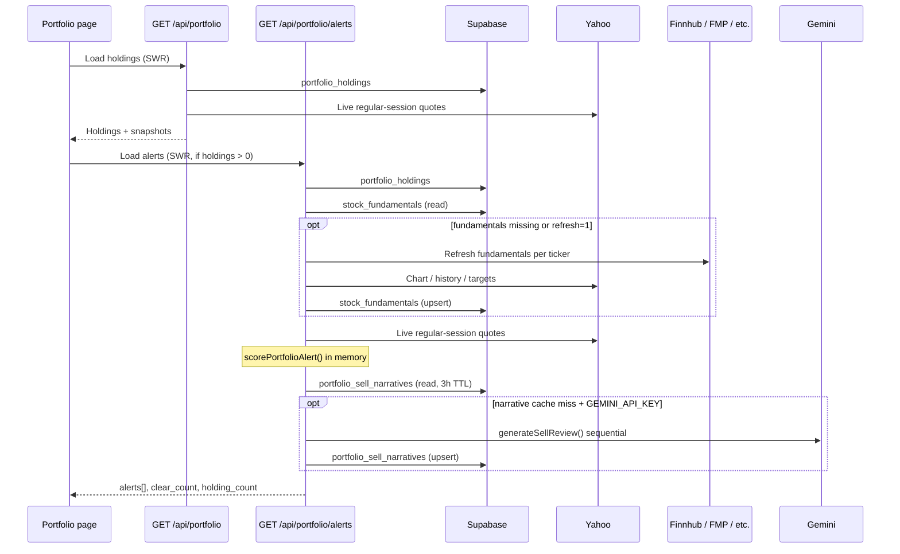

# Portfolio review — architecture & data flow

The **Portfolio review** section on the Portfolio tab flags holdings that show several independent weak signals. It is a **conservative review aid**, not a sell engine. Copy is phrased as “worth a calm review,” not “sell now.”

---

## What the user sees

| UI piece | Source |
|----------|--------|
| Portfolio summary bar | Client-side from `/api/portfolio` (holdings + live prices) |
| **Portfolio review** accordion | `/api/portfolio/alerts` |
| Alert cards (Review / Watch badges, factor chips, P&L grid) | Scoring output + cached narrative |
| **Why review this holding?** accordion | `review_reason` + `caveat` (Gemini or mechanical) |
| Your holdings list | `/api/portfolio` |

### Severity

| Badge | Internal `severity` | Meaning |
|-------|---------------------|---------|
| **Review** | `red` | Score ≥ 42 and ≥ 3 bearish factors |
| **Watch** | `watch` | Score ≥ 24 and ≥ 2 bearish factors |

Headlines come from `ALERT_HEADLINES` in `src/lib/portfolio-alert-scoring.ts`.

### Dev sample data

When the portfolio is **empty**, users can tap **Preview sample review alerts** to render `PORTFOLIO_ALERT_DEMO` from `src/lib/portfolio-alerts.ts` (no API calls).

---

## End-to-end pipeline

**Scoring always runs on every alerts request.** Only fundamentals refresh and LLM narratives are cached.

---

## API routes

### `GET /api/portfolio`

**File:** `src/app/api/portfolio/route.ts`

| Step | Action |
|------|--------|
| 1 | Auth → load `portfolio_holdings` for user |
| 2 | `fetchRegularSnapshotsForTickers()` → Yahoo v7 quote (regular session price only) |
| 3 | Fire-and-forget logo warm (`stock_logos`) |

**Response headers**

| Market state | `Cache-Control` |
|--------------|-----------------|
| Live refresh active (regular / pre / post) | `private, no-store` |
| Closed | `private, max-age=3600` |

Used for: summary bar, holding cards, cost vs value, today’s %.

---

### `GET /api/portfolio/alerts`

**File:** `src/app/api/portfolio/alerts/route.ts`

**Query params**

| Param | When | Effect |
|-------|------|--------|
| (none) | Default | Read cached fundamentals; reuse fresh narratives |
| `refresh=1` | Manual refresh during live market only | Force fundamentals reload; **skip** narrative cache read (still writes new narratives) |

**Pipeline**

1. Load `portfolio_holdings` for user.
2. Read `stock_fundamentals` for all holding tickers.
3. If table missing, any ticker missing fundamentals, **or** `refresh=1` → `loadFundamentalsForTickers()` (full external refresh + DB upsert).
4. Yahoo live prices → `scorePortfolioAlert()` per holding.
5. `rankAlerts()` → sort by score, then severity.
6. For alert tickers only: load `portfolio_sell_narratives` (3h TTL).
7. Cache miss → `generateSellReview()` (Gemini) or `mechanicalSellReview()` fallback.
8. Upsert new narrative rows.

**Response:** always `Cache-Control: private, no-store`.

**Not used on this route:** Google News RSS, watchlist, picks scoring.

---

### `POST /api/portfolio/sync`

Upload Vested `.xlsx` → replaces user’s `portfolio_holdings`. Does not run review scan until the client refetches alerts.

---

## Scoring (no cache)

**Rules:** `src/lib/portfolio-alert-scoring.ts`  
**Helpers / demo / mechanical copy:** `src/lib/portfolio-alerts.ts`

Inputs per holding:

- `portfolio_holdings` row (quantity, avg cost, ticker)
- Live **regular-session** price (Yahoo)
- `stock_fundamentals` row (trends, analysts, news sentiment, 52W, support, target)

### Bearish factors (examples)

| Factor | Typical data source |
|--------|---------------------|
| Down on cost and still sliding | Price + `change_30d_pct` |
| Underwater vs your cost | Price vs avg cost |
| No meaningful bounce yet | P&L + flat 30d |
| Sharp 30-day decline | `change_30d_pct` (Yahoo chart) |
| Recent weeks still weak | `change_14d_pct` |
| Heavy sell ratings | Finnhub recommendation |
| Negative news tone | Finnhub `news_sentiment` |
| Below recent support | `support_20d` (Yahoo-derived, freshness gate 36h) |
| Near 52-week low | Yahoo 52W range |
| Above typical target | Resolved target vs price |

### Bullish offsets (reduce score, shown as green chips)

| Factor | Source |
|--------|--------|
| Strong buy ratings | Finnhub |
| Healthy 30-day trend | Yahoo chart |
| Near 52-week high | Yahoo chart |

### Thresholds (tunable in scoring file)

| Constant | Value |
|----------|-------|
| `MIN_BEARISH_FACTORS` | 2 (minimum to show any alert) |
| `WATCH_SCORE_THRESHOLD` | 24 |
| `RED_SCORE_THRESHOLD` | 42 |
| `RED_MIN_BEARISH_FACTORS` | 3 |
| `NARRATIVE_TTL_HOURS` | 3 (narratives only, not scores) |

---

## Caching architecture

### Supabase tables

| Table | Scope | Used for review |
|-------|--------|-----------------|
| `portfolio_holdings` | Per user | Positions, cost basis |
| `stock_fundamentals` | **Global** shared cache | Trends, analysts, news sentiment, targets, support |
| `portfolio_sell_narratives` | **Global** per ticker | `review_reason`, `caveat`, LLM model id |
| `stock_logos` | Global | Logos only (async) |

RLS: holdings are private; fundamentals and sell narratives are readable by all authenticated users (shared cache).

### TTL summary

| Layer | TTL | Notes |
|-------|-----|-------|
| **Alert scores** | None | Recomputed every `/api/portfolio/alerts` call |
| **Sell narratives** | **3 hours** | `portfolio_sell_narratives.generated_at` |
| **Fundamentals price/trend row** | **30 min** | `stock_fundamentals.fetched_at` during US market hours |
| **Fundamentals when market closed** | Stale OK | Price row not refreshed after close; target-only refresh may still run |
| **Analyst price target** | Until **5pm IST** daily reset | `target_fetched_at` in `stock_fundamentals` |
| **Support chip data** | **36 hours** max age | Scoring ignores stale `support_20d` |
| **Portfolio JSON (browser)** | `no-store` when live; 1h when closed | `/api/portfolio` only |
| **Alerts JSON (browser)** | Always `no-store` | |

---

## External providers

### Yahoo Finance

| Call | Route | Purpose |
|------|-------|---------|
| v7 `/finance/quote` | `/api/portfolio`, `/api/portfolio/alerts` | Regular-session price & today % |
| v8 `/finance/chart` | Fundamentals refresh | 7d / 14d / 30d %, 52W high/low, volume, `support_20d` |
| quoteSummary / session | Target fallback chain | Sector, price targets |

**Caching:** Live quote fetches use `cache: 'no-store'`. Not persisted except via `stock_fundamentals` upsert.

**Frequency (typical user with holdings, market open):**

- Every **15s**: portfolio refetch → Yahoo quotes for all holdings (via live refresh hook).
- Each refetch triggers **alerts refetch** too → another Yahoo quote batch + in-memory rescore.
- Fundamentals Yahoo calls only when DB row missing/stale or `?refresh=1`.

### Finnhub

Used inside **fundamentals refresh** (`fetchStockPriceData`):

- `/stock/recommendation` → buy/hold/sell counts (heavy sell / strong buy rules)
- `/news-sentiment` → `news_sentiment` (negative news tone rule)

Also in **target chain**: `/stock/price-target` if FMP/Eulerpool miss.

**Frequency:** Only when `stock_fundamentals` row needs refresh (30 min window, or forced refresh).

### FMP / Eulerpool / StockAnalysis / Yahoo

Analyst **target price** resolution chain in `fetchAndResolveTarget()` — not on every alert request, only on fundamentals refresh when target cache expired (daily 5pm IST).

### Google Gemini

**Function:** `generateSellReview()` in `src/lib/llm.ts`  
**Models:** `gemini-2.5-flash` → fallback `gemini-2.5-flash-lite`  
**When:** Only for tickers that **passed scoring** AND narrative cache miss AND `GEMINI_API_KEY` set  
**Rate limit:** Sequential calls, **1.2s delay** between tickers (`LLM_CALL_DELAY_MS`)  
**Fallback:** `mechanicalSellReview()` — template from factor list, no API

**Not cached in Gemini** — results stored in `portfolio_sell_narratives`.

### Google News RSS

**Not used** by portfolio review. News influence is via Finnhub aggregate `news_sentiment` on the fundamentals row.

---

## Client refresh behavior

**File:** `src/app/(app)/portfolio/page.tsx`

| Trigger | `/api/portfolio` | `/api/portfolio/alerts` |
|---------|------------------|-------------------------|
| Open Portfolio tab | SWR fetch | SWR fetch (if holdings) |
| Live refresh (regular session) | Every **15s** | Same tick (via `refreshPrices`) |
| Pre/post market | Every **2 min** (background, no countdown bar) | Same |
| Nav refresh button (market open) | SWR revalidate | `?refresh=1` then merge into SWR |
| After Vested sync | Refetch | Refetch |

SWR: `revalidateOnFocus: false`, alerts `dedupingInterval: 0`.

---

## First visit vs steady state (example: 5 holdings, 2 alerts)

Assume fundamentals already warmed from watchlist/picks.

### First alerts load (narrative cache empty)

| Provider | Calls |
|----------|-------|
| **DB** | `portfolio_holdings`, `stock_fundamentals` read, `portfolio_sell_narratives` read (miss) |
| **Yahoo** | 1× quote batch (5 tickers) |
| **Finnhub / FMP** | 0 if fundamentals fresh in DB |
| **Gemini** | Up to 2 sequential calls (one per alert ticker) |
| **DB write** | Up to 2 narrative upserts |

### Second load within 3 hours (same holdings, same alert tickers)

| Provider | Calls |
|----------|-------|
| **DB** | Same reads; narrative **hit** |
| **Yahoo** | 1× quote batch (every refetch) |
| **Finnhub / FMP** | 0 |
| **Gemini** | **0** |
| **DB write** | 0 |

Scoring still runs every time — alert list can change if prices move even when narratives are cached.

### Manual refresh (`?refresh=1`, market open)

- Forces fundamentals external refresh for all holding tickers (Yahoo + Finnhub per stale row).
- Clears narrative cache **read** (regenerates Gemini/mechanical for all current alerts).
- Upserts `stock_fundamentals` + `portfolio_sell_narratives`.

---

## Key files

| Area | Path |
|------|------|
| Alerts API | `src/app/api/portfolio/alerts/route.ts` |
| Holdings API | `src/app/api/portfolio/route.ts` |
| Scoring rules | `src/lib/portfolio-alert-scoring.ts` |
| Narrative builders + demo data | `src/lib/portfolio-alerts.ts` |
| Narrative cache (3h) | `src/lib/narrative-cache.ts` |
| Fundamentals load/refresh | `src/lib/load-fundamentals.ts`, `src/lib/fundamentals-fetch.ts` |
| Live prices | `src/lib/live-prices.ts` |
| Gemini | `src/lib/llm.ts` |
| Portfolio UI | `src/app/(app)/portfolio/page.tsx` |
| DB migration (narratives table) | `supabase/migrations/007_portfolio_sell_alerts.sql` |

---

## Tuning the feature

1. **Alert sensitivity** — edit constants and rules in `src/lib/portfolio-alert-scoring.ts`.
2. **Headline copy** — `ALERT_HEADLINES` in the same file.
3. **Mechanical review text** — `mechanicalSellReview()` in `src/lib/portfolio-alerts.ts`.
4. **LLM prompt** — `buildSellReviewPrompt` / `generateSellReview` in `src/lib/llm.ts`.
5. **Narrative TTL** — `NARRATIVE_TTL_HOURS` in `src/lib/narrative-cache.ts` (shared with Picks narratives).
