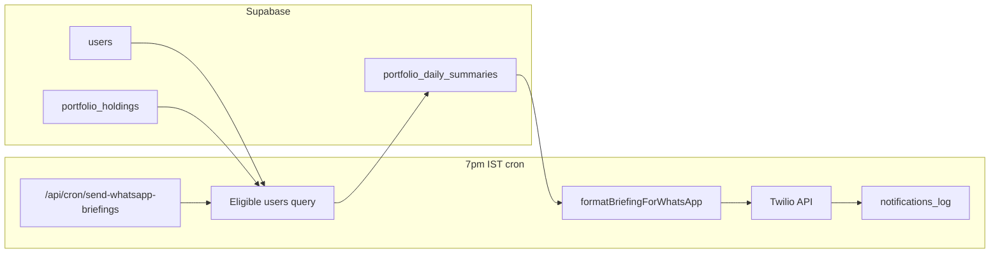

# WhatsApp daily portfolio briefing (Twilio) — plan

**Status:** Phase 1 + 2 implemented (sandbox MVP)

**Goal:** Send the cached **Daily Portfolio Summary** to WhatsApp every day at **7:00pm IST** (**Mon–Fri only**) for users who opted in, have a valid **Indian mobile number**, and have at least one synced holding.

**Related:** [portfolio-daily-summary.md](./portfolio-daily-summary.md), IST cron window in `src/lib/cron/window.ts`

---

## Locked product decisions

| Decision | Choice |
|----------|--------|
| Send days | **Mon–Fri only** — no WhatsApp on Sat/Sun |
| Phone | **India only** — 10-digit mobile (stored as `+91XXXXXXXXXX`) |
| Verification | **Format check only** — valid 10 digits starting with 6–9; **no OTP/SMS** |
| Settings entry | **Gear icon in header** (`AppNav`) — not a bottom tab |
| Max holdings in message | 6 lines + “N more in app” |
| Portfolio day % in opener | Yes |

---

## 1. What already exists (good news)

| Piece | Status |
|-------|--------|
| `users.whatsapp_number` | Column exists (`001_initial_schema.sql`) |
| `users.preferences` jsonb | Column exists — store opt-in flag |
| `notifications_log` | Table exists with `channel: 'whatsapp'` |
| `portfolio_daily_summaries` | Per-user briefing JSON cache |
| `portfolio_holdings` | Synced portfolio detection |
| Daily briefing generator | `regeneratePortfolioSummaryForUser()` |

**No Twilio code yet.** No settings page yet.

---

## 2. Eligibility (who gets the message)

Send only when **all** are true:

1. `users.preferences->>'whatsapp_daily_briefing' = 'true'` (opt-in)
2. `users.whatsapp_number` is non-null, valid **Indian mobile** — 10 digits, first digit 6–9, stored as **`+91` + 10 digits**
3. User has **≥1 row** in `portfolio_holdings`
4. A `portfolio_daily_summaries` row exists (generate before send if missing/stale on weekday)
5. Not already sent today (dedupe via `notifications_log` — see §7)
6. **Today is Mon–Fri IST** (cron does not run Sat/Sun)

---

## 3. Settings page + header

### Route

- **`/settings`** — mobile-first, single column
- Link from **gear icon** in header (`AppNav.tsx`) — between logo area and avatar/sign-out

### Fields

| Field | Storage | Notes |
|-------|---------|-------|
| WhatsApp number | `users.whatsapp_number` | UI: fixed **+91** prefix + **10-digit** input (no country picker) |
| Daily briefing toggle | `users.preferences.whatsapp_daily_briefing` | Default `false` — explicit opt-in |
| Status line | read-only | “Last sent · Tue 7:00pm” from `notifications_log` |

### Phone validation (no OTP)

Client + server:

- Strip spaces/dashes; must be exactly **10 digits**
- Must match `/^[6-9]\d{9}$/` (standard Indian mobile)
- Persist as `+91{10digits}` for Twilio (e.g. `+919876543210`)
- Show inline error: “Enter a valid 10-digit Indian mobile number”

No SMS OTP, no Twilio Verify — saving settings is enough to opt in.

### Copy (important for compliance)

- “Send my portfolio daily briefing to WhatsApp at 7:00pm IST”
- “You can turn this off anytime”
- Link to privacy note: message includes holdings tickers and summary text

### APIs

| Method | Path | Purpose |
|--------|------|---------|
| GET | `/api/user/settings` | Load phone + preferences + last send time |
| PATCH | `/api/user/settings` | Update phone + opt-in (validate 10-digit IN server-side) |

Auth: NextAuth session → service-role Supabase update on own `user_id` only.

---

## 4. WhatsApp message format

Twilio WhatsApp messages should stay **short and scannable** (~1,600 chars safe; max 4,096).

### Template structure (plain text v1)

```
Stocklens · Daily briefing
Portfolio {+/-X.X%} today

{portfolio_headline — 1 line}

• MDB — {headline or first sentence of summary}
• MU — …
…

{max 8 holdings; if more: "+ N more in app"}

Open portfolio: {short link or app URL}
```

**Rules:**

- Use **ticker + one line** per stock (not full 2-sentence LLM copy for every name if >6 holdings)
- Portfolio with **>10 holdings**: top 6 by absolute day move + “+4 more in Stocklens”
- If briefing is **stale** (>24h): prefix “As of {date} ·” 
- Footer: `Reply STOP to opt out` (required for compliance — map STOP to toggle off)

### Twilio templates (production)

WhatsApp **Business-initiated** messages outside the 24h user-reply window require an **approved Content Template** (Meta).

**Phase 1 (dev):** Twilio WhatsApp Sandbox — user sends “join {code}” once.

**Phase 2 (prod):** Register template e.g. `daily_portfolio_briefing` with variables:

- `{{1}}` portfolio day %
- `{{2}}` headline
- `{{3}}` holdings block (pre-formatted in code)

---

## 5. Twilio integration

### Env vars

```env
TWILIO_ACCOUNT_SID=
TWILIO_AUTH_TOKEN=
TWILIO_WHATSAPP_FROM=whatsapp:+14155238886   # sandbox or approved sender
```

Add to `src/lib/env.ts` (optional keys — cron no-ops if missing).

### Lib

**`src/lib/twilio/whatsapp.ts`**

- `normalizeIndianWhatsAppNumber(input: string)` → `+91XXXXXXXXXX` or validation error
- `isValidIndianMobile(digits: string)` → `/^[6-9]\d{9}$/`
- `sendWhatsAppMessage(to: string, body: string)` → Twilio REST API (`to: whatsapp:+91…`)
- `sendWhatsAppTemplate(to, contentSid, variables)` — Phase 2

### Cost (rough)

- Twilio WhatsApp ~$0.005–0.08/msg depending on country
- 100 users × 30 days ≈ 3,000 msgs/month — budget accordingly
- **No Gemini cost** on send path if briefing already cached

---

## 6. Cron: 7:00pm IST, Mon–Fri only

### Schedule

**7:00pm IST = 13:30 UTC** → `30 13 * * 1-5` (weekdays only — **no Sat/Sun**)

| Job | Path | When |
|-----|------|------|
| Send WhatsApp briefings | `/api/cron/send-whatsapp-briefings` | Mon–Fri 7:00pm IST |

Add to `vercel.json`. Route also checks IST weekday via `getCronWindowStatus()` / dedicated helper — skip with `{ skipped: true, reason: 'weekend' }` if invoked on Sat/Sun.

### Send pipeline (`src/lib/cron/send-whatsapp-briefings.ts`)

For each eligible user (batch, e.g. 20/run with 1s delay):

```
1. Assert today is Mon–Fri IST (else exit)
2. Load portfolio_daily_summaries.payload
3. If missing or stale (>3h) → regenerateWithLock (7pm Mon–Fri is inside IST allowed generation window)
4. formatBriefingForWhatsApp(payload) → string
5. twilio send to whatsapp:+91…
6. INSERT notifications_log (type: 'daily_briefing', channel: 'whatsapp', delivered: true/false)
7. On permanent failure (invalid number) → set whatsapp_daily_briefing false + log
```

### IST window interaction

- **7:00pm IST Mon–Fri** → inside allowed generation window (3pm–3am) — refresh briefing before send if stale
- **Sat/Sun** → cron **does not run**; no messages sent

---

## 7. Dedupe & idempotency

Prevent double sends if cron retries:

```sql
-- Already sent today (IST calendar day)?
SELECT 1 FROM notifications_log
WHERE user_id = $1
  AND type = 'daily_briefing'
  AND channel = 'whatsapp'
  AND sent_at >= start_of_ist_day(now())
```

Index: `(user_id, type, channel, sent_at DESC)` — already have `notif_user_sent_idx`.

---

## 8. DB migration (minimal)

**Option A (preferred v1):** No new columns — use existing:

```json
// users.preferences
{
  "whatsapp_daily_briefing": true
}
```

**Option B (v1.1):** Migration `019_whatsapp_briefing.sql`

```sql
ALTER TABLE users
  ADD COLUMN IF NOT EXISTS whatsapp_opt_in boolean NOT NULL DEFAULT false;

CREATE INDEX IF NOT EXISTS users_whatsapp_eligible_idx
  ON users (whatsapp_opt_in, whatsapp_number)
  WHERE whatsapp_opt_in = true AND whatsapp_number IS NOT NULL;
```

Service-role policy for cron: already uses service role (bypasses RLS).

---

## 9. STOP / opt-out webhook (Phase 2)

**`POST /api/webhooks/twilio/whatsapp`**

- Inbound “STOP” → set `whatsapp_daily_briefing: false`
- Twilio signature validation
- Reply with confirmation template

Required before marketing scale; can defer for sandbox beta.

---

## 10. Implementation phases

### Phase 1 — Settings + manual test (no cron)

- [ ] Settings page UI + **header gear** link in `AppNav.tsx`
- [ ] GET/PATCH `/api/user/settings`
- [ ] **`normalizeIndianWhatsAppNumber()`** — 10-digit validation, no OTP
- [ ] `formatBriefingForWhatsApp()` + unit tests
- [ ] Script `scripts/send-whatsapp-briefing-now.ts --user=email` for one-off test
- [ ] Twilio sandbox docs in README

### Phase 2 — Weekday cron

- [ ] `/api/cron/send-whatsapp-briefings` + `vercel.json` entry **`30 13 * * 1-5`**
- [ ] Eligibility query + dedupe + `notifications_log`
- [ ] Batch limits (20 users/run; 1s between Twilio calls)

### Phase 3 — Production WhatsApp

- [ ] Meta Business verification + approved template
- [ ] STOP webhook → auto opt-out

---

## 11. Architecture diagram



---

## 12. Resolved decisions (locked)

| # | Question | **Decision** |
|---|----------|--------------|
| 1 | Send on Sat/Sun? | **No** — Mon–Fri only |
| 2 | Phone format? | **India only** — 10 digits, stored as `+91…` |
| 3 | OTP verify? | **No** — format validation only |
| 4 | Settings placement? | **Gear in header** |
| 5 | Max holdings in body? | 6 + “N more in app” |
| 6 | Portfolio day %? | Yes |

---

## 13. Files to add (estimate)

| File | Purpose |
|------|---------|
| `docs/whatsapp-daily-briefing.md` | This plan |
| `src/app/(app)/settings/page.tsx` | Settings UI |
| `src/app/api/user/settings/route.ts` | Read/update preferences |
| `src/lib/whatsapp/format-briefing.ts` | Payload → message text |
| `src/lib/twilio/whatsapp.ts` | Send helper |
| `src/lib/cron/send-whatsapp-briefings.ts` | Batch send logic |
| `src/app/api/cron/send-whatsapp-briefings/route.ts` | Cron entry |
| `scripts/send-whatsapp-briefing-now.ts` | Manual test |
| `supabase/migrations/019_...sql` | Optional index / opt-in column |

**Touch:** `AppNav.tsx`, `vercel.json`, `src/lib/env.ts`, `src/app/api/setup/migrate/route.ts`

---

## 14. Sample WhatsApp message (review)

```
Stocklens · Daily briefing
Portfolio +1.1% today

Gains led by MDB on a Goldman target lift; MU weighed on memory weakness.

• MDB — Goldman lift ahead of earnings in 12 days; shares +11% today
• MU — Down on the day with weak 30d trend; analysts skew cautious
• IREN — Consolidation after CoreWeave deal; still +47% over 30d
• OKLO — Near consensus target after licensing milestone

+2 more in the app

https://stocklens.app/portfolio
```

---

**Next step:** Implement Phase 1 (settings + 10-digit phone + format + manual send script), then Phase 2 weekday cron.
